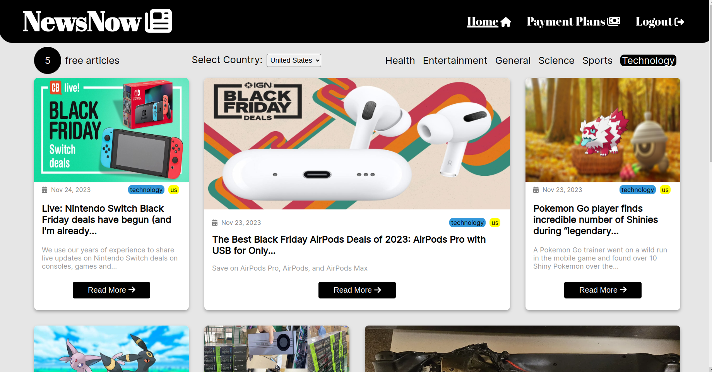
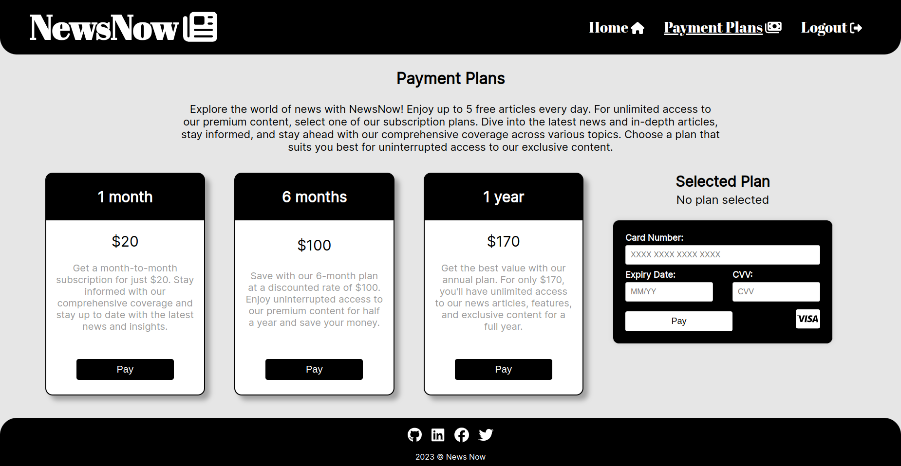
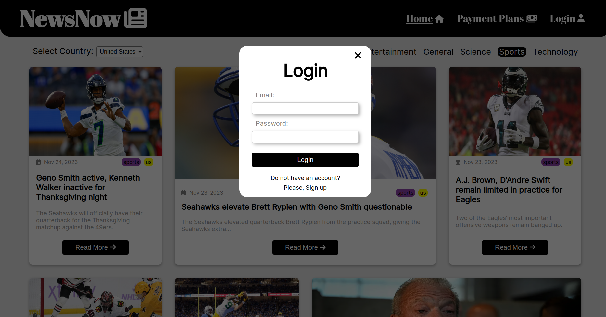

# NewsNow

[NewsNow Website](https://sensational-praline-09301d.netlify.app/)

Welcome to NewsNow, your go-to platform for viewing the news! NewsNow is based on the data fetched from GNews API and stored at the json file, providing a convenient way to explore headlines from the US, Poland, and Ireland across various categories like sports, entertainment, technology, etc.

## Screenshots

## Project Overview

### Introduction

NewsNow is a frontend web application that brings you news articles from different countries and categories. Users can explore headlines without logging in, but to read full articles, they need to log in. Authenticated users enjoy up to 5 free articles per day. Once the limit is reached, users are prompted to choose a subscription plan for continued access.

### Features

- Country-Specific News: news articles from the US, Poland, and Ireland.
- Category Filters: news in categories such as sports, entertainment, technology, and more.
- Log in to access the full content of news articles.
- Limited Free Articles: authenticated users can read up to 5 free articles per day.
- Subscription Plans: choose a subscription plan and make payments for extended access after reaching the free article limit.
- Responsive Design.

### Technologies Used

The Booklists project is built using the following technologies:

- React (Vite)
- react-router-dom library
- CSS
- HTML
- Netlify for deployment

## Getting Started

To get started with the NewsNow project, follow these steps:

1. Clone the repository.
2. Navigate to the folder `cd NewsNow`.
3. Install the necessary dependencies `npm i`.
4. Run the application `npm run dev`.
5. Go to `http://localhost:5173/`.

## How to Use

1. Explore News: visit the NewsNow website to explore headlines and articles.
2. Register and Log In: log in to access the full content of news articles.
3. Limited Free Articles: authenticated users can read up to 5 free articles per day.
4. Subscription Plans: choose a subscription plan to continue accessing articles beyond the free limit.

## Possible future improvements
- Typescript
- Backend integration based on Node.js 
- Database integration based on MongoDB
- With database it will be possible to refresh 5 free articles each midnight for users, who are registered but did not pay
- Redux instead of context
- Find more reliable free news API to update the news every day

